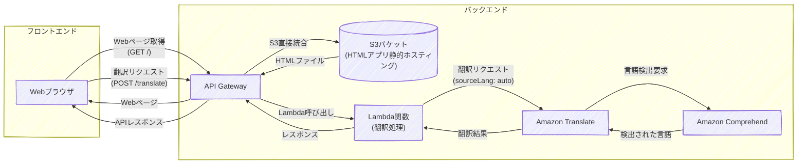

# AWS Translate Demo - CDK Project

このプロジェクトは、AWS CDKを使用してAWS Translateを活用した翻訳Webアプリケーションのインフラを構築するサンプルです。

## アーキテクチャ



## 構成要素

- **S3バケット**: Reactアプリの静的ファイル保存
- **API Gateway**: 
  - S3への直接プロキシ統合による静的ファイル配信
  - 翻訳APIエンドポイント
- **翻訳処理Lambda関数**: 翻訳処理を行うサーバーレス関数
- **Amazon Translate**: 多言語翻訳サービス
- **IAMロール**: API GatewayがS3にアクセスするための権限

## 前提条件

- Node.js (v18以上)
- AWS CLI設定済み
- AWS CDK CLI (`npm install -g aws-cdk`)

## デプロイ手順

1. **依存関係のインストール**
   ```bash
   npm install
   ```

2. **CDKのブートストラップ（初回のみ）**
   ```bash
   npx cdk bootstrap
   ```

3. **デプロイ**
   ```bash
   npx cdk deploy
   ```

4. **アクセス**
   デプロイ完了後、出力されるWebsite URL（API Gateway URL）にアクセスしてください。

## 使用方法

1. デプロイ完了後に出力されるWebsite URLにアクセス
2. 翻訳したいテキストを入力
3. 翻訳元・翻訳先言語を選択
4. 「翻訳する」ボタンをクリック

## リソースの削除

```bash
npx cdk destroy
```

## 主要なファイル

- `lib/cdk-stack.ts`: CDKスタック定義
- `lambda/translate/index.js`: 翻訳処理Lambda関数のコード
- `lambda/translate/package.json`: 翻訳処理Lambda関数の依存関係
- `frontend/index.html`: フロントエンドアプリケーション
- `bin/cdk.ts`: CDKアプリケーションエントリーポイント

## 注意事項

- このサンプルは学習目的で作成されています
- 本番環境で使用する場合は、セキュリティ設定を適切に行ってください
- AWS Translateの利用料金が発生します
